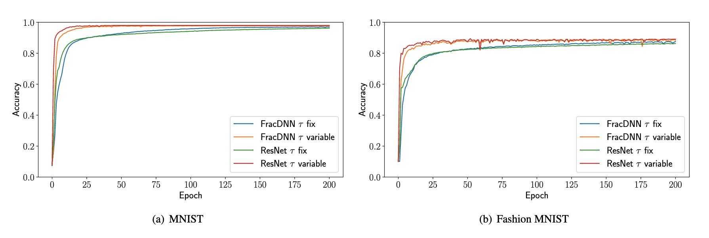

# An implementation of time variable learning architectures

This repository provides a PyTorch Implementation of time - variable neural network architectures, as presented in https://arxiv.org/abs/2204.08528. Furthermore, it contains an example, how these architectures can be used. The code given here as an example was the code used for the numerical experiments for the Paper https://arxiv.org/abs/2306.16111. 

## Installation and Usage

To reproduce the results from the paper mentioned above, simply clone this repository and run the `main.py` script. **Before** running the script, make sure to set the root directory in the `utils.py` file to your root directory for torchvision datasets. The script `main.py` will run all the experiments and save the results in `.json` files in a subdirectory `results/`. You can use this results to obtain the plots from the paper like the following:

    
    
Accuracies compared for trainable and fixed τ with different network architectures, demonstrating the benefits of only six additional trainable parameters.

The `.json` files generated provide information about the respective training run using the following naming convention: 
 - `"losses"`: Minibatch - train losses (for each Iteration).
 - `"tau_tracking"`: Values of the (remaining) $\tau$, in order of their appearance in the network.
 - `"test_losses"`: Value of the loss function evaluated on the test set. Evaluated before the first and after each epoch.
 - `"test_accs"`: Test set accuracy evaluated on the test set. Evaluated before the first and after each epoch.
 - `"clean_losses"`: Only the MSE part of the train loss. Differs from `"losses"` iff $\ell^1$ or time horizon regularization is used.
 - `"lr"`, `"n_epochs"`, `"tau_is_trainable"`, `"l1_reg"`, `"l2_reg"`, `"tau_sum_factor"`, `"T"`, `"internal_dimension"`, `"number_of_tau_blocks"`, `"adaptive_pruning"`, `"dependent_last_tau"`, `"batch_size"`: Metadata about the experiment.

If you're interested in using the network architectures in your own research, you achieve this by either copying the `modules/tau_modules.py` file to your working directory or by installing it to your virtual Python using 

`python setup.py install`

which will install the package tau_modules to your active virtual environment.

### Dependencies
The only dependency of our code is PyTorch.

## Contact us

If you have further questions or find a bug in the code, feel free to contact us by e-mail: frederik.koehne@uni-bayreuth.de
